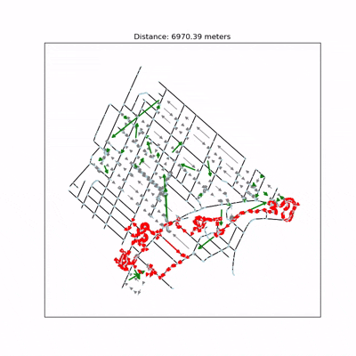

C'est un excellent projet pour mettre en valeur vos compétences en Recherche Opérationnelle et en modélisation.
# ❄️ Montreal Snow Removal Optimization : Logistique par Drone et Recherche Opérationnelle

## 📸 Démonstration



-----

## 🌟 Présentation du Projet

Ce projet vise à **optimiser les trajets des équipes de déneigement de la ville de Montréal** en se basant sur la **Recherche Opérationnelle** et la simulation.

L'objectif principal est de planifier des itinéraires efficaces et économiques en utilisant les données géographiques réelles de Montréal, en respectant les contraintes de circulation, et en modélisant l'état d'enneigement via l'analyse par drones.

-----

## ✨ Fonctionnalités et Simulations

Le projet est divisé en plusieurs simulations clés qui modélisent différentes étapes de l'opération de déneigement :

### Étape 1 : Analyse par Drone (Collecte de Données)

Les scripts simulent la collecte de données sur le terrain, souvent basée sur le **Problème du Facteur Cheval (Chinese Postman Problem)** pour garantir que toutes les routes sont inspectées efficacement.

  * `Drone/one_postman_length_start_coordinates.py` : Simule le parcours d'un drone à partir de coordonnées spécifiques (génère plusieurs animations).
  * `Drone/one_postman_length_diff_start.py` : Simule le parcours d'un drone en variant les points de départ (`num_start_nodes`).
  * `Drone/two_postmen_animation.py` : Simule l'optimisation des trajets pour une équipe de deux drones (double couverture).

### Étape 2 : Simulation de Déneigement (Optimisation)

Ces scripts se concentrent sur la planification et l'optimisation des trajets des déneigeuses, en utilisant les données d'enneigement :

  * `Snowplow/cpp_directed_real_animation.py` : Simule le parcours d'une déneigeuse en tenant compte des **sens de circulation** réels (modèle dirigé).
  * `General/snow_simulation_reel.py` : Simule l'état d'**enneigement** dans un quartier.
  * `Snowplow/divide_sector_snow.py` : Simule le parcours de la déneigeuse uniquement sur les **routes enneigées**, optimisant ainsi les ressources.

### Étape 3 : Analyse Générale

Le dossier `Miscellanous` contient des scripts et des analyses qui ont permis de valider les modèles et de comparer différentes approches de modélisation.

-----

## 🛠️ Installation et Utilisation

### Prérequis

  * Python 3.x
  * Les dépendances listées dans le fichier `requirements.txt`.
  * [Source des données :](https://donnees.montreal.ca/dataset/geobase) Utilisation de la **géobase de Montréal** pour les données cartographiques réelles.

### Installation

Installez les dépendances requises via `pip` :

```bash
pip install -r requirements.txt
```

### Utilisation (Exemples)

Pour lancer une simulation de déneigement :

```bash
# Exemple : Simulation avec respect des sens de circulation
python Snowplow/cpp_directed_real_animation.py
```

Pour simuler le parcours d'un drone :

```bash
# Exemple : Parcours de deux drones
python Drone/two_postmen_animation.py
```

-----

## 🤝 Contributeurs

Ce projet a été réalisé en collaboration par :

  * Baucher Tael
  * Chedal-Anglay Berenger
  * Godin Nathan
  * Hallier Flavien
  * Kanounnikoff Martin
